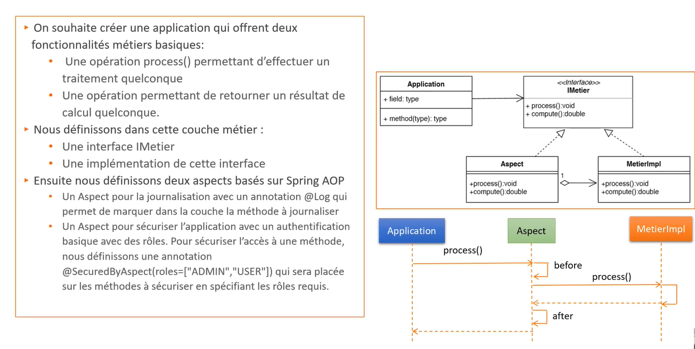
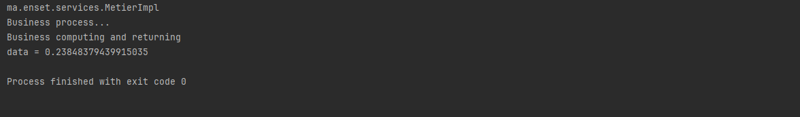
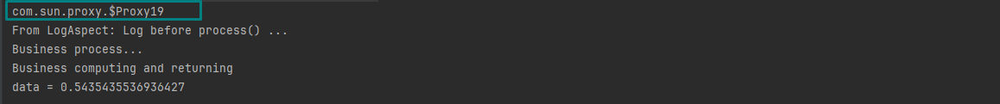
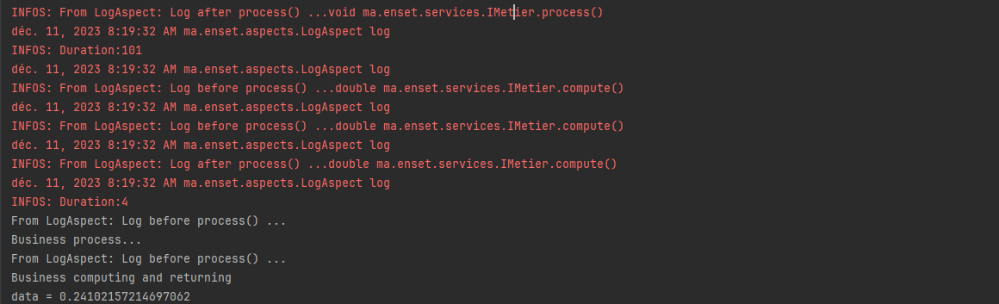
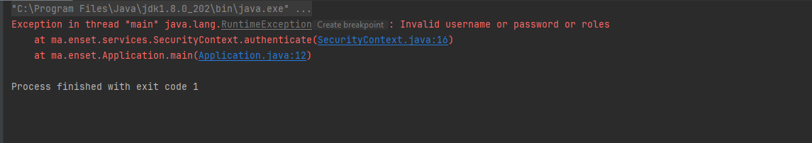

## Programmation Orientée Aspect (AOP) avec Spring AOP

### 1. Introduction
La Programmation Orientée Aspect (AOP) complète la Programmation Orientée Objet (OOP) en fournissant une autre manière de penser à la structure d'un programme. L'unité clé de modularité en OOP est la classe, tandis qu'en AOP, l'unité de modularité est l'aspect. Les aspects permettent la modularisation des préoccupations (telles que la gestion des transactions) qui traversent plusieurs types et objets. (Ces préoccupations sont souvent appelées préoccupations transversales dans la littérature sur l'AOP.)<br>

***Spring AOP*** utilise soit des proxies dynamiques JDK, soit CGLIB pour créer le proxy d'un objet cible donné. Pour utiliser les proxies JDK, nous avons besoin d'au moins une interface, tandis qu'avec CGLIB, nous avons besoin d'une seule classe non final.<br>

Dans cette activité nous allons travailler sur l'applicattion suivante :<br>


### Ajout des dépendances nécessaires
Pour utiliser Spring AOP, nous devons ajouter les dépendances suivantes à notre fichier pom.xml :<br>
```xml

<dependencies>
    <dependency>
        <groupId>org.springframework</groupId>
        <artifactId>spring-core</artifactId>
        <version>5.2.5.RELEASE</version>
    </dependency>
    <dependency>
        <groupId>org.springframework</groupId>
        <artifactId>spring-context</artifactId>
        <version>5.2.5.RELEASE</version>
    </dependency>
    <dependency>
        <groupId>org.springframework</groupId>
        <artifactId>spring-beans</artifactId>
        <version>5.2.5.RELEASE</version>
    </dependency>
    <dependency>
        <groupId>org.springframework</groupId>
        <artifactId>spring-aop</artifactId>
        <version>5.2.5.RELEASE</version>
    </dependency>
    <dependency>
        <groupId>org.springframework</groupId>
        <artifactId>spring-aspects</artifactId>
        <version>5.2.5.RELEASE</version>
    </dependency>
</dependencies>
```
On va créer une clsse MetierImpl qui implémente l'interface IMetier :<br>
```java
@Service
public class MetierImpl implements IMetier {
    @Override
    public void process() {
        System.out.println("Business process...");
    }

    @Override
    public double compute() {
        double data = Math.random();
        System.out.println("Business computing and returning");
        return data;
    }
}
```
### Exécution de l'application
```java
@ComponentScan(value = {"ma.enset.services", "ma.enset.aspects"})
public class Application {
    public static void main(String[] args) {
        ApplicationContext applicationContext
                = new AnnotationConfigApplicationContext(Application.class);

        IMetier metier = applicationContext.getBean(IMetier.class);
        System.out.println(metier.getClass().getName());
        metier.process();
        System.out.println("data = " + metier.compute());
    }
}
```



### Création d'un LogAspect
```java

@Component
@Aspect
@EnableAspectJAutoProxy
public class LogAspect {
    @Before("execution(public void process())")
    public void log() {
        System.out.println("From LogAspect: Log before process() ...");
    }

    @Around("execution(* ma.enset.services..*(..))")

    public Object log(ProceedingJoinPoint proceedingJointPoint) throws Throwable {
        long t1 = System.currentTimeMillis();
        logger.info("From LogAspect: Log before process() ..." + proceedingJointPoint.getSignature());
        Object result = proceedingJointPoint.proceed();
        logger.info("From LogAspect: Log before process() ..." + proceedingJointPoint.getSignature());
        long t2 = System.currentTimeMillis();
        logger.info("From LogAspect: Log after process() ..." + proceedingJointPoint.getSignature());
        logger.info("Duration:" + (t2 - t1));
        return result;
    }
}
```
Dans cet aspect on ajoute les annotations suivantes :<br>
- @Component : pour que Spring puisse détecter cet aspect et le gérer comme un bean Spring.
- @Aspect : pour indiquer à Spring que c'est un aspect.
- @EnableAspectJAutoProxy : pour activer l'auto-proxying basé sur les annotations.


### Exécution de l'application




On constate que le nom de la classe de l'objet métier a changé, c'est parce que Spring a créé un proxy pour l'objet métier et a ajouté le code de l'aspect à ce proxy.

Ce proxy est généré dynamiquement par Spring AOP et il est de type CGLIB proxy.


#### @Log
Maintenant, on va créer une annotation @Log qui va nous permettre de logger les méthodes annotées par cette annotation.<br>
```java
@Retention(RetentionPolicy.RUNTIME)
@Target(ElementType.METHOD)
public @interface Log {
}
```
On va l'ajouter à la méthode process() :<br>
```java
@Service
public class MetierImpl implements IMetier {
    @Override
    @Log
    public void process() {
        System.out.println("Business process...");
    }
}
```
On va créer un aspect SecuredByAspect:<br>
```java
@Retention(RetentionPolicy.RUNTIME)
@Target(ElementType.METHOD)
public @interface SecuredByAspect {
    String[] roles();
}
```
On va ajouter une classe qui va prendre en charge l'aspect SecuredByAspect :<br>
```java
```

On va ajouter une classe utilitaire qui va nous permettre de vérifier si l'utilisateur connecté a le droit d'accéder à la méthode annotée par @SecuredByAspect :<br>
```java
public class SecurityContext {
    private static String username = "";
    private static String password = "";
    private static String[] roles = {};

    public static void authenticate(String u, String p, String[] r) {
        if (username == null || password == null || roles == null)
            throw new RuntimeException("Invalid username or password or roles");

        else if (username.equals("root") && password.equals("1234")) {
            username = u;
            password = p;
            roles = r;
        } else throw new RuntimeException("Invalid username or password or roles");

    }

    public static boolean hasRole(String role) {
        for (String r : roles) {
            if (r.equals(role)) return true;
        }
        return false;
    }
}
```
On va ajouter l'aspect AuthorisationAspect :<br>
```java
@Component
@Aspect
@EnableAspectJAutoProxy
public class AuthorisationAspect {
    @Around(value = "@annotation(securedByAspect)", argNames = "proceedingJointPoint,securedByAspect")
    public Object secure(ProceedingJoinPoint proceedingJointPoint, SecuredByAspect securedByAspect) throws Throwable {
        String[] roles = securedByAspect.roles();
        boolean authorized = false;
        System.out.println("From AuthorisationAspect: Authorisation before process() ...");
        for (String role : roles) {
            if (SecurityContext.hasRole(role)) {
                authorized = true;
                break;
            }

        }
        if (authorized) {
            Object result = proceedingJointPoint.proceed();
            return result;
        }
        throw new RuntimeException("Not authorized");
    }
}

```

### Exécution de l'application
On va ajouter l'annotation @SecuredByAspect à la méthode compute() en donnant le role ADMIN et on tente d'exécuter l'application en tant que USER.<br>
```java
@Override
    @SecuredByAspect(roles = {"ADMIN"})
    public double compute() {
        double data = Math.random();
        System.out.println("Business computing and returning");
        return data;
    }
```
On aura une exception montrant que l'utilisateur n'est pas authorisé à accéder à la méthode compute() :<br>



```java
